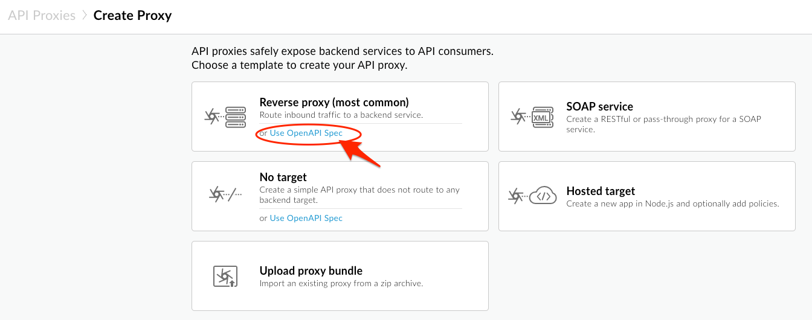
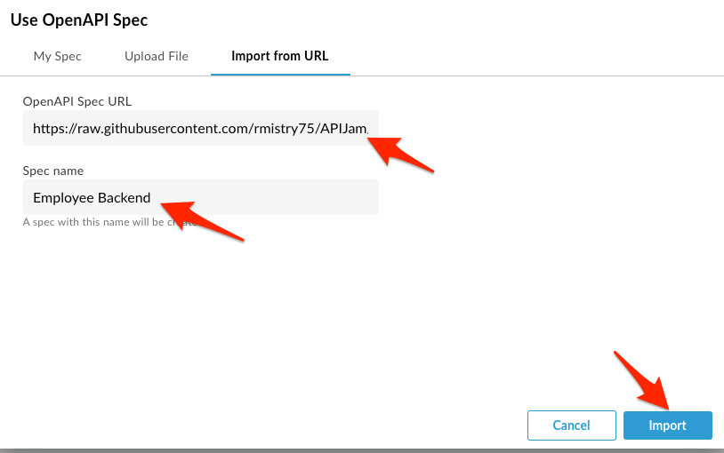
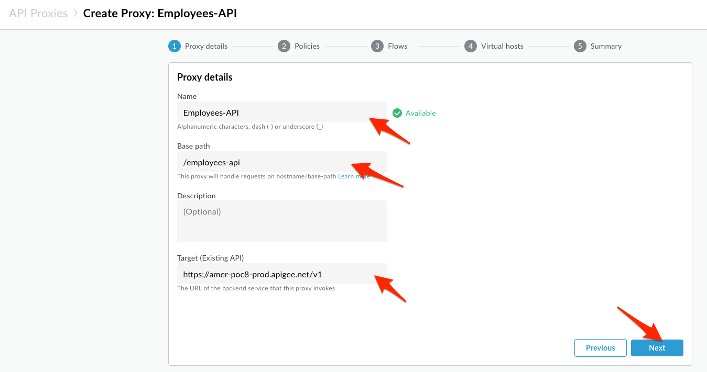
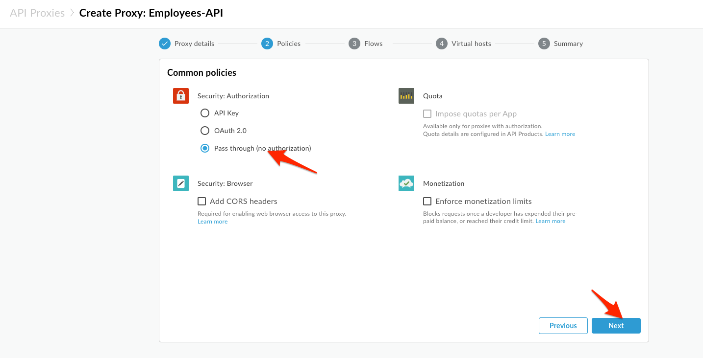
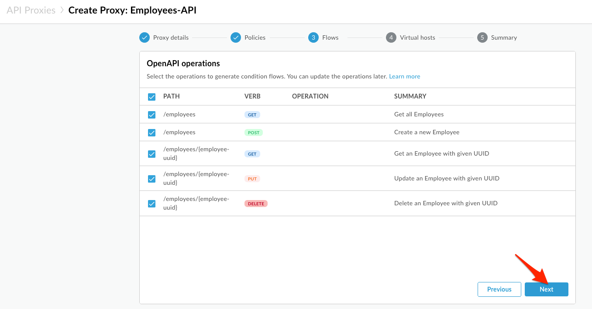
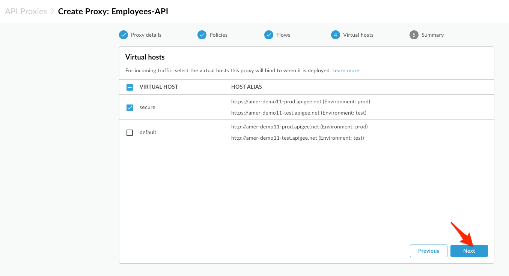
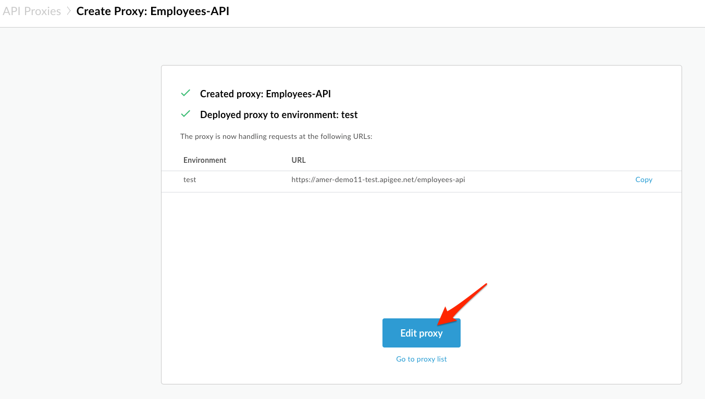
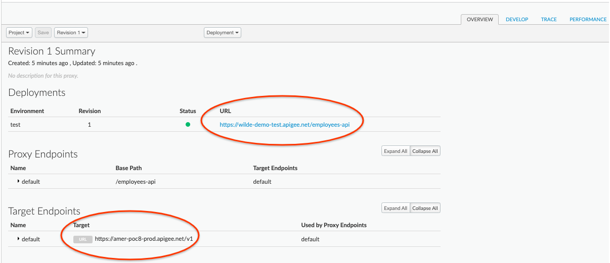
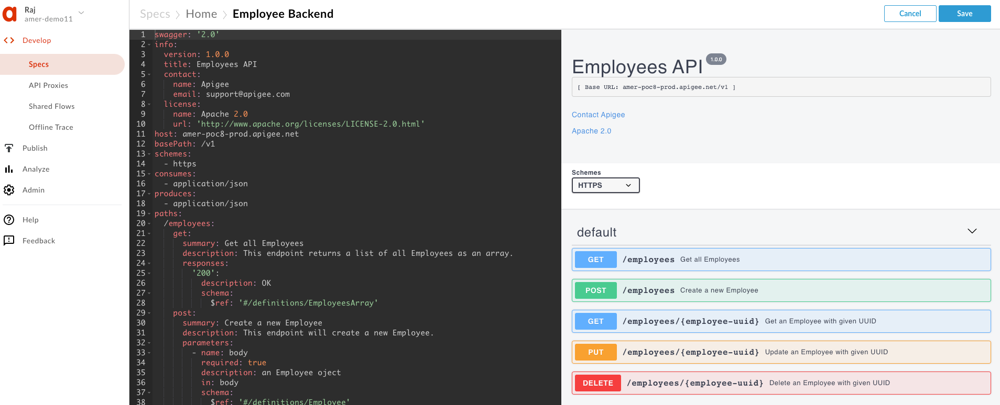

# API Design : Create a Reverse Proxy from OpenAPI Spec

*Duration : 10 mins* 

*Persona : API Team*

# Use case

You have a requirement to create a reverse proxy for taking HTTP requests from the Internet and forwarding them to an existing backend service. You have decided to follow a design first approach & build a reusable component, a specification which can be used to build API proxies, generate API documentation, and generate API test cases using OpenAPI Specification format. You would like to generate an Apigee API Proxy by using the OpenAPI Specification (Swagger) instead of building the API Proxy from scratch.

# How can Apigee Edge help?

Apigee Edge enables you to quickly expose backend services as APIs. You do this by creating an API proxy that provides a facade for the backend service that you want to expose. Apigee Edge out of the box supports the OpenAPI specification, allowing you to auto-generate API proxies. Apigee Edge also has an OpenAPI specification editor & store which you can use to maintain your OpenAPI specifications. 

The API proxy decouples your backend service implementation from the API that developers consume. This shields developers from future changes to your backend services. As you update backend services, developers, insulated from those changes, can continue to call the API uninterrupted.

In this lab, we will see how to create a reverse proxy that routes inbound requests to existing HTTP backend services using a readily available OpenAPI specification.

# Pre-requisites

Basic understanding of [OpenAPI Specification](https://github.com/OAI/OpenAPI-Specification) (Swagger)

# Instructions

* Go to [https://apigee.com/edge](https://apigee.com/edge) and log in. This is the Edge management UI. 

* Select **Develop → API Proxies** in the side navigation menu

* Click **+Proxy** The Build a Proxy wizard is invoked. 

* Under **Reverse proxy**, Click on **Use OpenAPI spec** below reverse proxy option.

* You should see a popup with access to either use a previously imported Open API Spec, upload a new Spec or Import from a URL. Select the **Import from URL** tab. Here, provide the following values:

  * URL: [https://raw.githubusercontent.com/rmistry75/APIJam/master/Basic/Resources/employee-spec.yaml](https://raw.githubusercontent.com/rmistry75/APIJam/master/Basic/Resources/employee-spec.yaml)
  
  * Spec Name: Employee Backend

* Click **Import** 

* You should see the "Proxy details" screen as shown below. Leave the default values (unless there is a conflict). Click **Next** to continue.

* You should see the "Policies" screen as shown below.  Leave the default values and click **Next** to continue.

* You should see the "Flows" screen as shown below. Ensure all flows/paths are selected and click **Next**.

* You should see the "Virtual hosts" screen as shown below. Only choose the secure (https) virtual host and click on **Next**.

* You should see the "Summary" page as shown below. You are now ready to build and deploy your API proxy.  **Click the "test" environment checkbox and click Create and deploy**.

* You should see that the proxy has been created and deployed to the test environment as shown below. Click **Edit proxy**.

* You should see that the proxy has been generated, uploaded, and deployed to test. Once the API proxy is built and deployed, click the **employees-v1** link to view your proxy in the proxy editor.

* You should see the proxy **Overview** screen.

* *Congratulations!* ...You have now built a reverse proxy for an existing backend service.

* You can also edit Open API Specs within Apigee. Click on **Develop > Specs** from side navigation menu.

* You should see your spec in the list.

* Click on the spec from the list to access the OpenAPI spec editor and interactive documentation that lists the backend API details and resources.

# Test the API Proxy

* Let us test the newly built API proxy using the [Apigee REST Client](https://apigee-restclient.appspot.com/). Open the REST Client in a new browser window.  

* Copy the URL for your API proxy. 

* Paste the link into the REST Client and make a GET call

* You should see a success response (200 OK) with employee data.

# Download the API Proxy

* Let’s download the API Proxy locally as an API Bundle so that we can reuse it in other labs.

* Download the API Proxy by downloading the current revision of the proxy. Return to the Overview tab, and see screenshot below for instructions.

# Lab Video

If you like to learn by watching, here is a short video on creating a reverse proxy using an Open API Specification - [https://youtu.be/3XBG9QOUPzg](https://youtu.be/3XBG9QOUPzg) 

# Earn Extra-points

* Now that you have created a reverse proxy using an OpenAPI spec, click on the "Develop" tab and explore the flow conditions populated from the OpenAPI spec. Also, explore the OpenAPI Spec editor where you can edit the OpenAPI specification and test the API requests. Finally, explore the "Trace" tab in the proxy overview page.

# Quiz

1. How do you import the proxy bundle you just downloaded? 
2. How does Apigee Edge handle API versioning? 
3. Are there administrative APIs to create, update and delete API proxies in Apigee?

# Summary

That completes this hands-on lesson. In this simple lab you learned how to create a proxy for an existing backend using an OpenAPI Specification and the Apigee proxy wizard.

# References

* Useful Apigee documentation links on API proxies:

    * Build a simple API Proxy - [https://docs.apigee.com/api-platform/fundamentals/build-simple-api-proxy](https://docs.apigee.com/api-platform/fundamentals/build-simple-api-proxy) 

    * Best practices for API proxy design and development - [https://docs.apigee.com/api-platform/fundamentals/best-practices-api-proxy-design-and-development](https://docs.apigee.com/api-platform/fundamentals/best-practices-api-proxy-design-and-development) 

* Watch this 4minute video on the "Anatomy of an API proxy" - [https://youtu.be/O5DJuCXXIRg](https://youtu.be/O5DJuCXXIRg) 

# Rate this lab

How did you like this lab? Rate [here](https://goo.gl/forms/G8LAPkDWVNncR9iw2).

Now go to [Lab-2](../Lab%202%20API%20Security%20-%20Securing%20APIs%20with%20API%20Keys)

