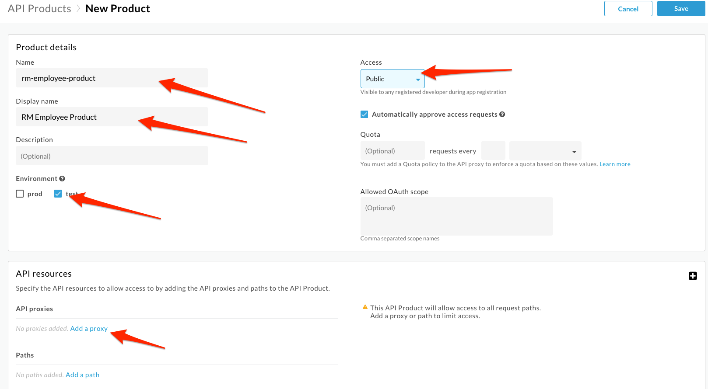
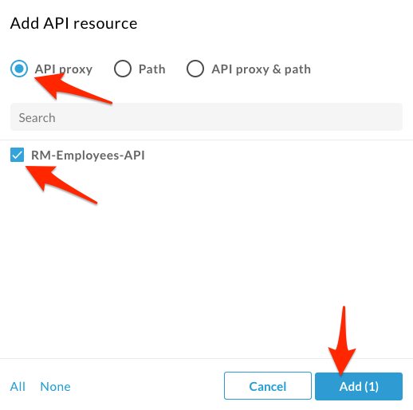
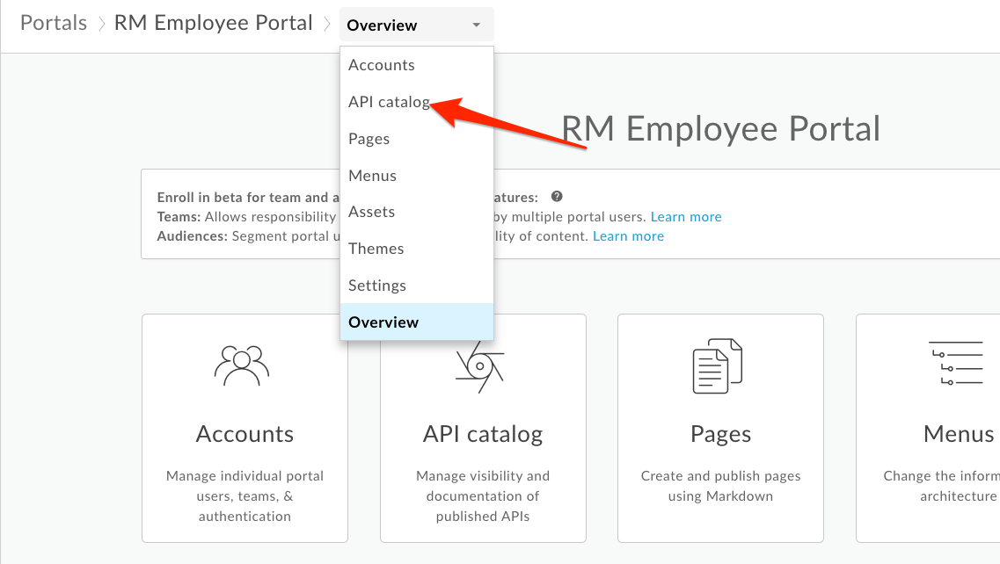

# API Publishing: API Products and Developer Portals

*Duration : 15 mins*

*Persona : API Team*

# Use case

You have an API proxy that you would like to share with app developers via a Developer Portal.  You want to enable developers to learn about, register for, and begin using your API proxy.

# How can Apigee Edge help?

Apigee Edge provides multiple options for your Developer Portal.  There is a lightweight portal that supports branding and customization of much of the site, such as theme, logos, and page content.  The lightweight portal can be published in seconds, directly from the management UI.  We also provide a Drupal-based portal if you want full control and to leverage any of the hundreds of Drupal modules available in the Drupal Market.  This lab focuses on the lightweight Apigee Developer Portal.

In this lab, you will create a Developer Portal and publish an OpenAPI specification that can be used by developers.

# Pre-requisites

For this lab, you will need…

* An OpenAPI specification uploaded to your Organization.  This specification will make up the documentation of your API proxy.  If you do not have an OpenAPI Specification available for this lab, revisit the lab *API Design : Create a Reverse Proxy from OpenAPI Spec* and then return here to complete these steps.

# Instructions

## Publish API as part of API Product

API products (which contain API proxies) are the unit of deployment to the Developer Portal, where App Developers can learn about, register for, and consume your APIs.  Read more about API products [here](https://docs.apigee.com/api-platform/publish/what-api-product).

* Select **Publish → API Products** from the side navigation menu

* Click  **+API Product**

* Populate the following fields

    * Section: Product details

        * Name: {your-initials}-employee-product
        
        * Display name: {Your Initials} Employee Product

        * Environment: test

        * Access: Public

    * Section: API resources

        * Section: API Proxies

            * Click the **Add a proxy** link

            

            * Select your Employee API Proxy and click **Add**.

            

* **Save** the API Product.

Note: We are adding the entire API Proxy to the API Product.  We can just as easily select one or more operations from one or more API proxies and bundle them together in an API Product.

## Publish a new Portal on Apigee Edge

* Select **Publish → Portals → +Portal**

* Enter details in the portal creation wizard. 

  * Name: {Your Initials} Employee API Portal

  * Description: Employee APIs

* Click **Create**

## Publish an API Product to the Portal

* Click the Portal Editor’s dropdown and select **API catalog**.

* Click **+** to select an API Product to publish to the Portal.

* Select the API Product to publish and click **Next**.

* Select "Published (listed in catalog)". 

* Select the "Anonymous users (anyone can view)" option so anyone can view this API through the portal. 

* Click the **Source API spece** dropdown and select **Select an OpenAPI Spec**.

* Select the OpenAPI Specification to use as a source. The current version (snapshot) of the selected OpenAPI Specification will be used to generate the documentation for this API product in the portal.

* Click **Save** to publish the API product (and OpenAPI Specification Snapshot) to the Developer Portal.
 
* You should now see your new API Product published to the portal. Click the **Live Portal** link to launch a browser tab/window with the new Developer Portal.

* In the Portal UI, click **APIs** to view the products that have been published. Products are used to bundle APIs together so that a developer can request access to a set of related functionality without registering for each API.  They are also useful for managing access to, and quotas for, particular developers.  For more on API products, [read this document](https://docs.apigee.com/api-platform/publish/what-api-product).

* The Portal will display live documentation based on the OpenAPI Specification. The left pane is an index of the resources and API calls documented. The center pane shows the documentation for the selected item. The right pane allows the user to try out the API. 

* Select the first API documented in the left pane. This API returns a list of all employees. Depending on the method, you’d expect to see model details, response codes, etc., as per the OpenAPI spec.

* Try the API yourself using the right pane. You'll receive an error. That's a good sign that our apikey policy is working correctly. Don't worry, we'll create a key and get the test working in the next lab!

# Lab Video

If you would rather watch a video that covers this topic, point your browser [here](https://youtu.be/_gDpzDJPNQg). (note: instead of using the "Street Carts" sample, use the "Employee API" that you have built in Lab 1).

# Earn Extra-points

* Add a second product to the portal and test it by launching the Live Portal.

* Update your API specification, and then [take a snapshot](https://docs-new.apigee.com/publish-apis#take-snapshot) of the specification to update the portal documentation. 

# Quiz

1. What are two reasons why you might publish multiple API products to the Developer Portal?

2. Changes made to OpenAPI Specification are made available in the Developer Portal automatically.  True or False?

# Summary

You’ve learned how to do the following:

* Deploy the Apigee Lightweight Developer Portal

* Publish an API Product with an OpenAPI Specification

* Use the Developer Portal UI to browse the OpenApi Specification Snapshot as a developer.

# Rate this lab

How did you link this lab? Rate [here](https://goo.gl/forms/j33WG2U0NFf02QHi1).

Now go to [Lab-4](../Lab%204%20API%20Consumption%20-%20Developers%20and%20Apps)
